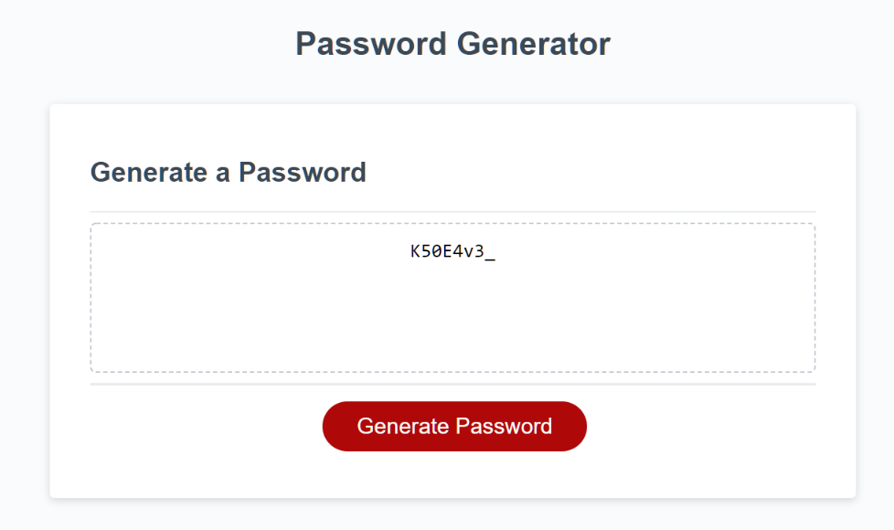

# Password-Generator

## Description
This in-browser app allows a user to generate a password based on several different variables.

It has the following features:
- An easy to navigate design with working buttons
- Pop-up prompts to help guide the user through the password generation process
- A form that prints the newly generated password once it is ready
- Four different password character types
- Validation to ensure that each chosen character type is used in the final product

## Installation
N/A

## Usage

See the published site: [here](https://stevengoldbergm.github.io/Password-Generator/)
- To use the webpage, simply click on the "Generate Password" button and follow the prompts.

## License
N/A
